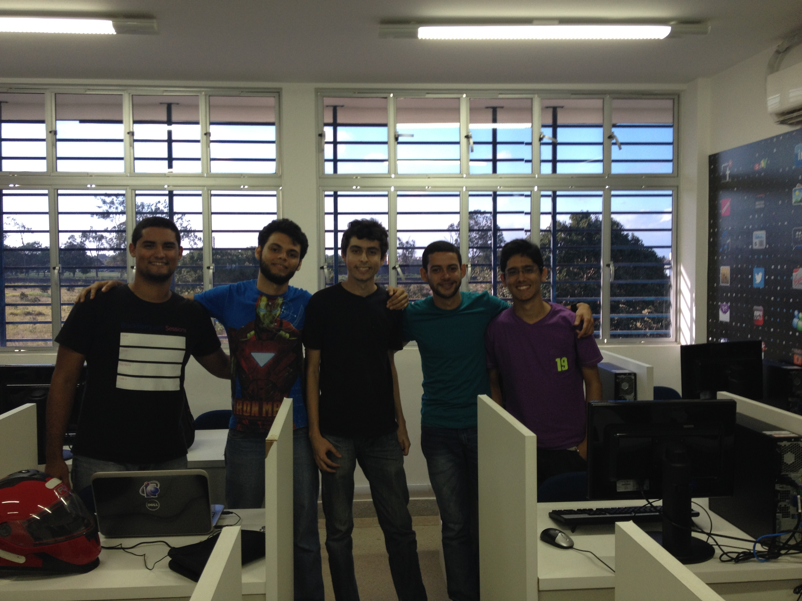
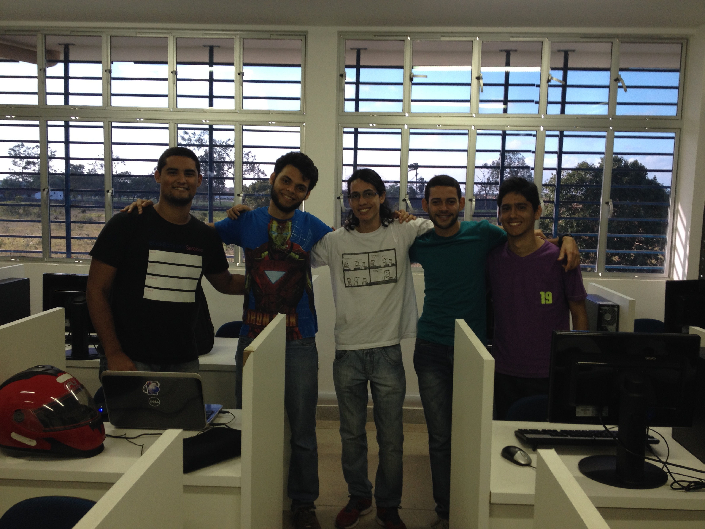
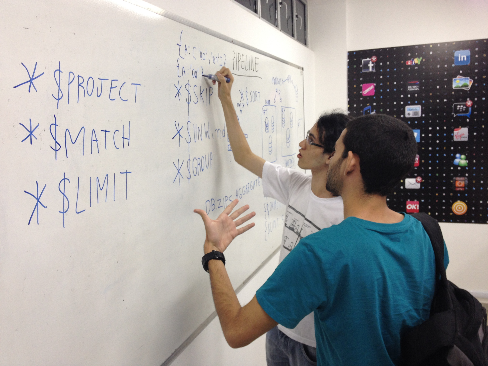
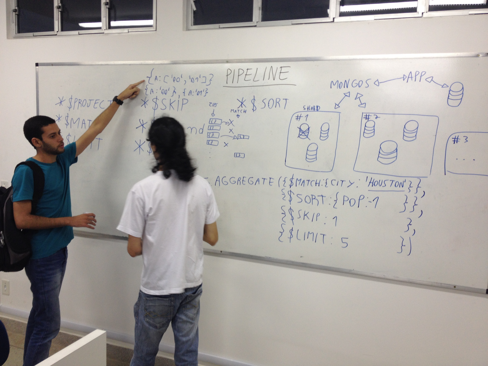
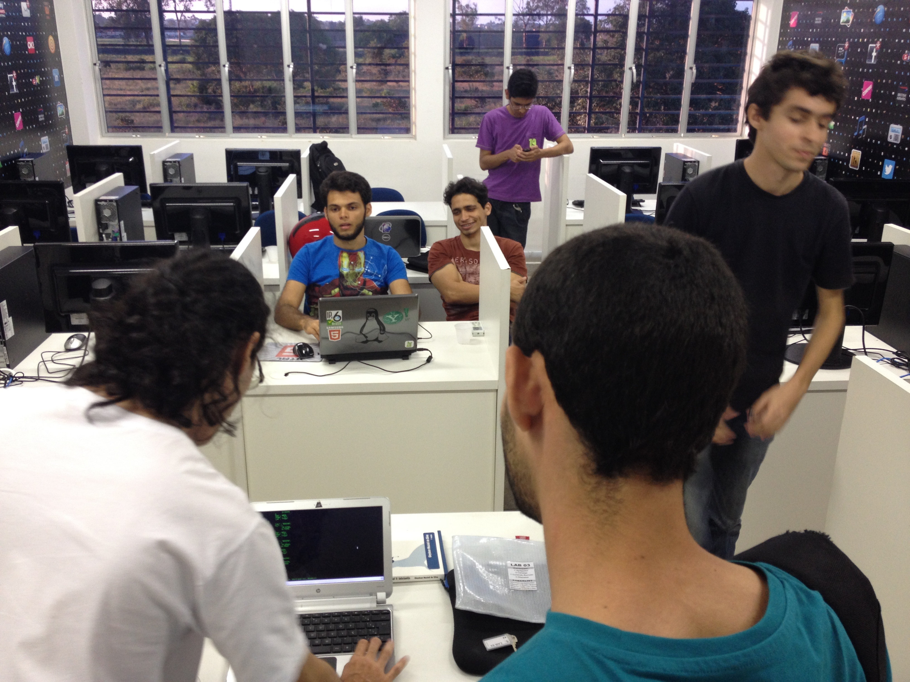
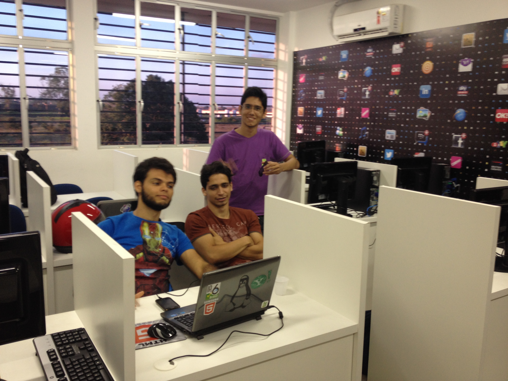
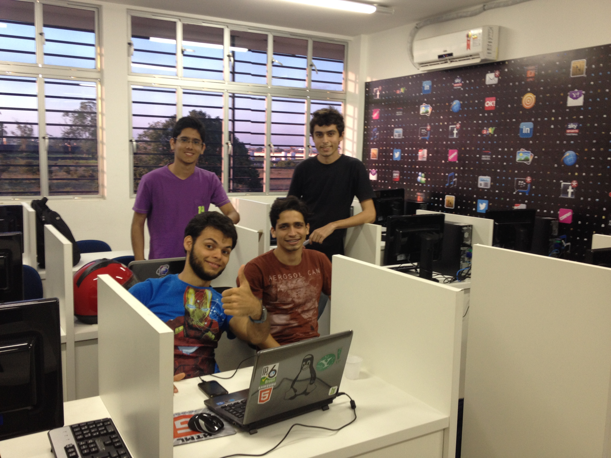
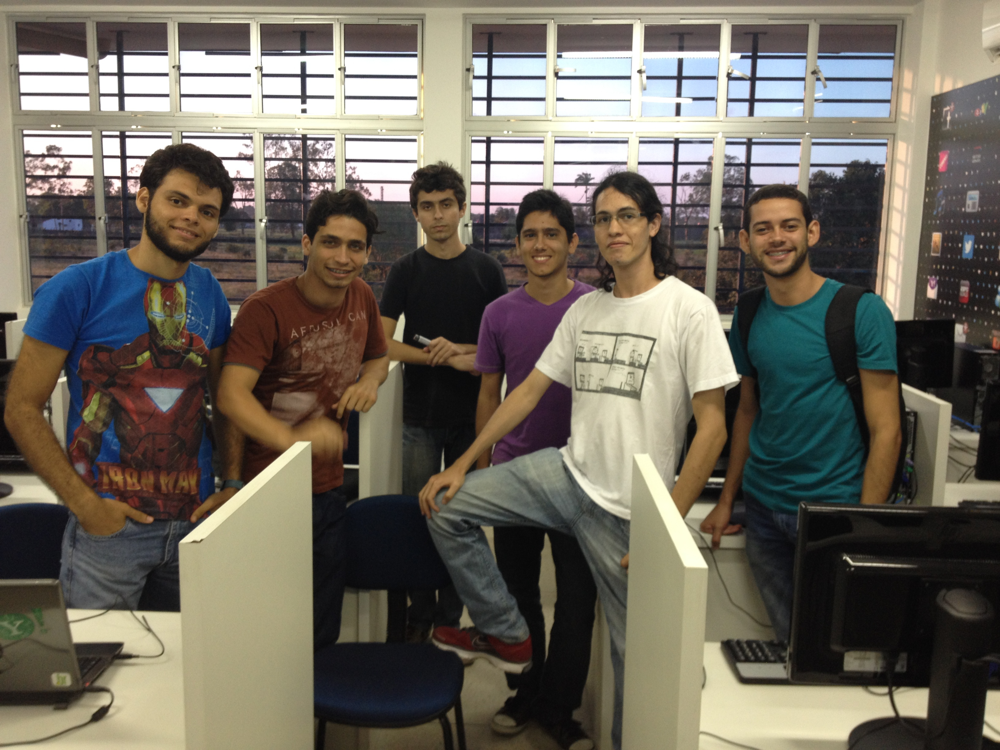
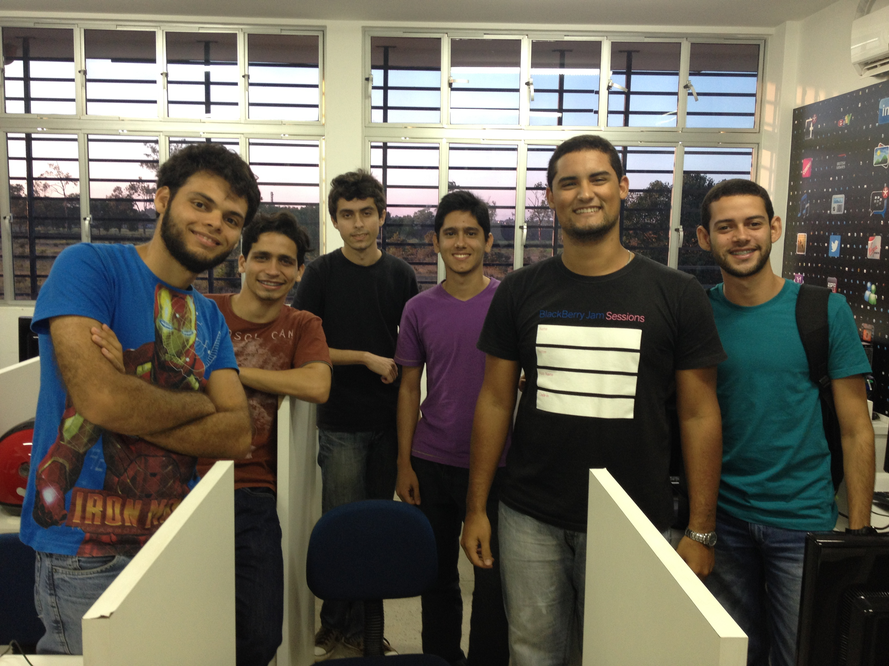

Quando: 18 de Outubro de 2013 - 14:30

Onde: UFAL - laboratório 3 do bloco de computação

## Anúncio original

Nesse minicurso será abordado o arcabouço de agregação de dados do MongoDB, que
permite a utilização de ricas consultas sobres os dados de uma coleção. O
minicurso ocorrerá através de exemplos que facilitem o aprendizado e
exemplifique as possibilidades desse arcabouço.

## Panfleto original

[mug.pdf](mug.pdf)

## Resultado

https://vinipsmaker.wordpress.com/2013/10/19/maceio-mongodb-user-group-primeiro-encontro/

## Fotos

