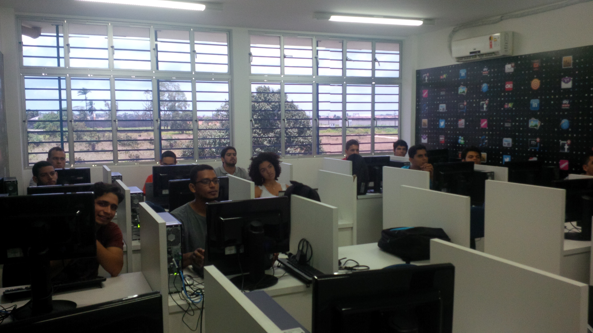
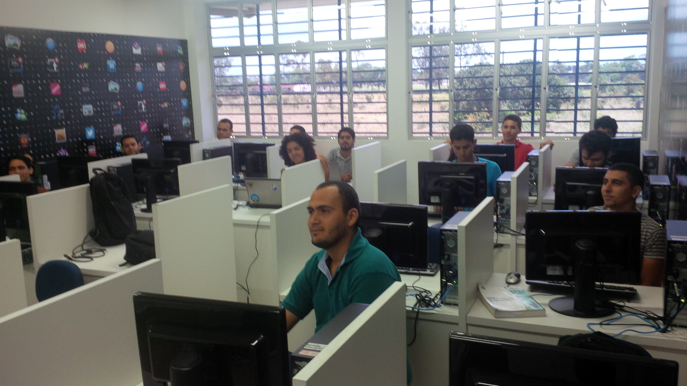
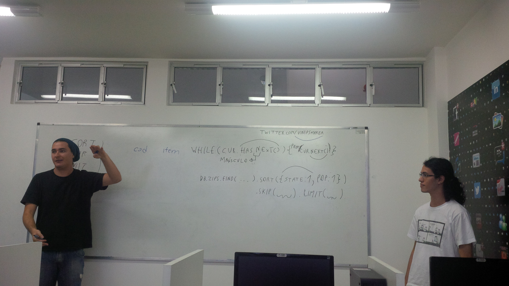
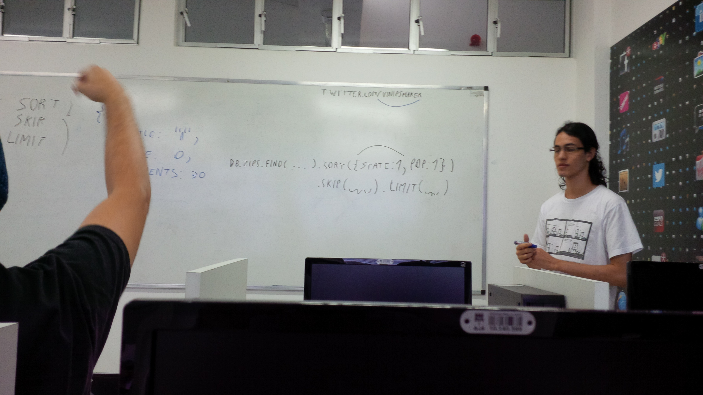
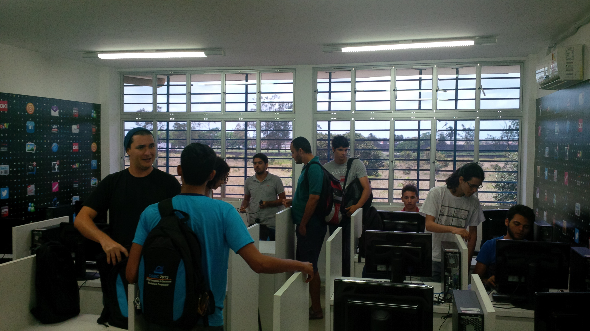

Quando: 18 de Outubro de 2013 - 9:15

Onde: UFAL - laboratório 3 do bloco de computação

## Anúncio original

O minicurso será voltado a iniciantes no MongoDB e deverá cubrir tópicos o
suficiente para se realizar a inserção, remoção, atualização e consulta de
objetos no MongoDB, utilizando os vários ricos operadores e as várias opções
(incluindo as que modificam a consulta), além dos conceitos básicos do MongoDB.

- Conhecimento de programação é necessário
- Conhecimento mínimo de programação orientada a objetos pode ajudar
- Pesquisar sobre o tema extremamente simples JSON antes do curso deve tornar o
  aprendizado mais eficiente

## Panfleto original

[mug.pdf](mug.pdf)

## Resultado

https://vinipsmaker.wordpress.com/2013/10/19/maceio-mongodb-user-group-primeiro-encontro/

## Fotos

