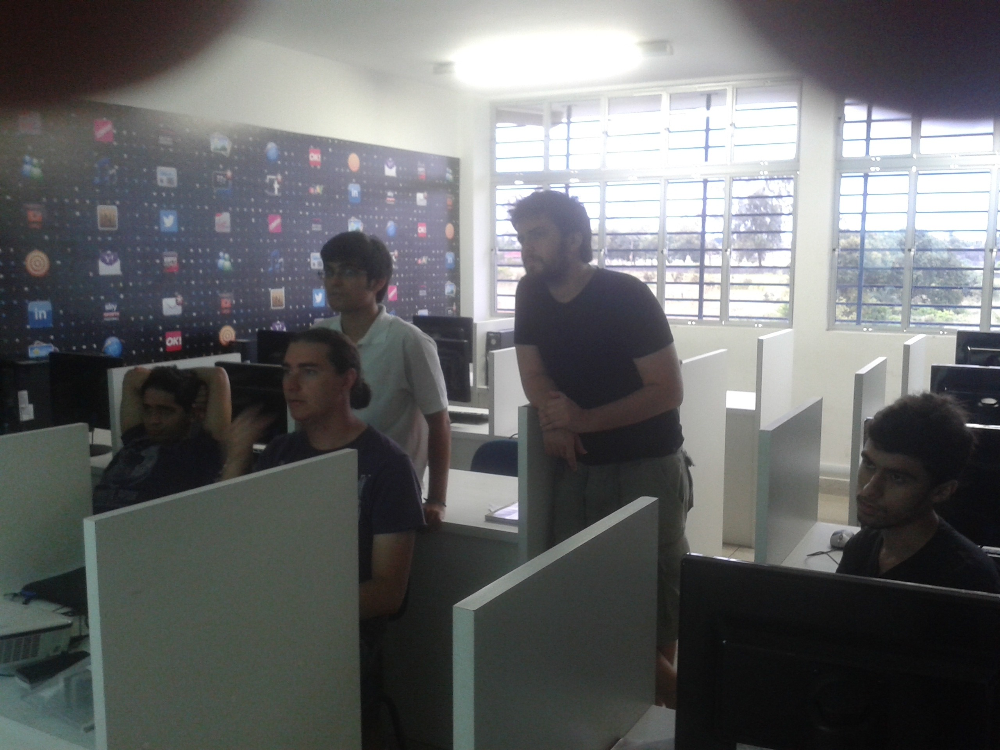
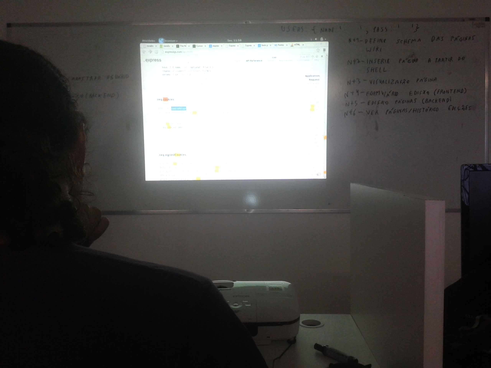

Quando: 22 de Novembro de 2013 - 9:00

Onde: UFAL - laboratório 3 do bloco de computação

## Anúncio original

### Requisitos:

- Conhecer MongoDB

### Node.js - por que?

- Usa JavaScript, assim como o próprio console do MongoDB e o navegador web do
  usuário, diminuindo o número de tecnologias que precisaremos conhecer

### A aplicação

- Wiki

### Coding dojo

- Coding dojo é um evento onde programadores se reúnem com o objetivo de
  aprender.
- **Não** é uma competição. Coding dojo é um evento colaborativo.
- O tema desse coding dojo será Node.js e a modalidade será a modalidade
  [Randori](http://codingdojo.org/cgi-bin/wiki.pl?RandoriKata).
- Ao confirmar sua presença, você irá precisar responder algumas perguntas. Suas
  respostas vão me ajudar a preparar melhor o evento, nivelando de acordo com a
  experiência que vocês possuem.

## Panfleto original

[mug2.pdf](mug2.pdf)

## Fotos

## Resultado

http://vinipsmaker.wordpress.com/2013/12/01/maceio-mongodb-user-group-segundo-encontro/
